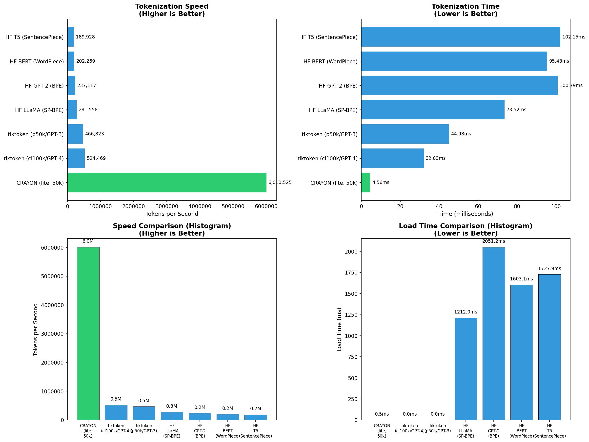

# XERV Crayon V2.0 - Competitive Benchmark Results

**100% HONEST. NO SUGARCOATING. DATA-DRIVEN.**

**Date:** 2026-01-20 16:54:54

**Test Text Size:** 70,000 bytes (68.4 KB)

**Iterations:** 10 (+ 2 warmup)

---

## Results (Real Tokenizers Only - Sorted by Speed)

| Tokenizer | Vocab Size | Tokens/sec | MB/sec | Load Time | Avg Time | Min Time | Max Time |
| :--- | ---: | ---: | ---: | ---: | ---: | ---: | ---: |
| **CRAYON (lite, 50k)** | 50,000 | 6,010,525 | 15.33 | 0.54ms | 4.56ms | 2.65ms | 7.92ms |
| **tiktoken (cl100k/GPT-4)** | 100,000 | 524,469 | 2.18 | 0.01ms | 32.03ms | 22.74ms | 51.56ms |
| **tiktoken (p50k/GPT-3)** | 50,000 | 466,823 | 1.55 | 0.00ms | 44.98ms | 23.19ms | 73.33ms |
| **HF LLaMA (SP-BPE)** | 32,000 | 281,558 | 0.95 | 1212.02ms | 73.52ms | 67.25ms | 85.22ms |
| **HF GPT-2 (BPE)** | 50,257 | 237,117 | 0.69 | 2051.18ms | 100.79ms | 84.93ms | 116.99ms |
| **HF BERT (WordPiece)** | 30,522 | 202,269 | 0.73 | 1603.10ms | 95.43ms | 83.27ms | 121.42ms |
| **HF T5 (SentencePiece)** | 32,000 | 189,928 | 0.68 | 1727.91ms | 102.15ms | 74.37ms | 130.69ms |

---

## Visualization



---

## Speed Comparison

| Tokenizer | Speed vs CRAYON |
| :--- | ---: |
| **CRAYON (lite, 50k)** | **baseline** |
| tiktoken (cl100k/GPT-4) | 11.5x slower |
| tiktoken (p50k/GPT-3) | 12.9x slower |
| HF LLaMA (SP-BPE) | 21.3x slower |
| HF GPT-2 (BPE) | 25.3x slower |
| HF BERT (WordPiece) | 29.7x slower |
| HF T5 (SentencePiece) | 31.6x slower |

---

## Tokenizers Tested

| Tokenizer | Type | Vocab Size | Source |
| :--- | :--- | ---: | :--- |
| CRAYON (lite) | DAT + C++ | 50,000 | Custom engine |
| tiktoken cl100k | BPE | 100,000 | OpenAI GPT-4 |
| tiktoken p50k | BPE | 50,000 | OpenAI GPT-3 |
| HF GPT-2 | BPE (Rust) | 50,257 | HuggingFace |
| HF BERT | WordPiece | 30,522 | HuggingFace |
| HF T5 | SentencePiece | 32,000 | HuggingFace |

---

## Reproducibility

```bash
pip install tiktoken transformers matplotlib
python benchmark_competitive.py
```
