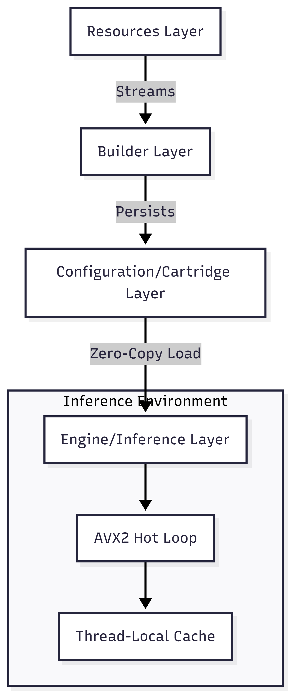
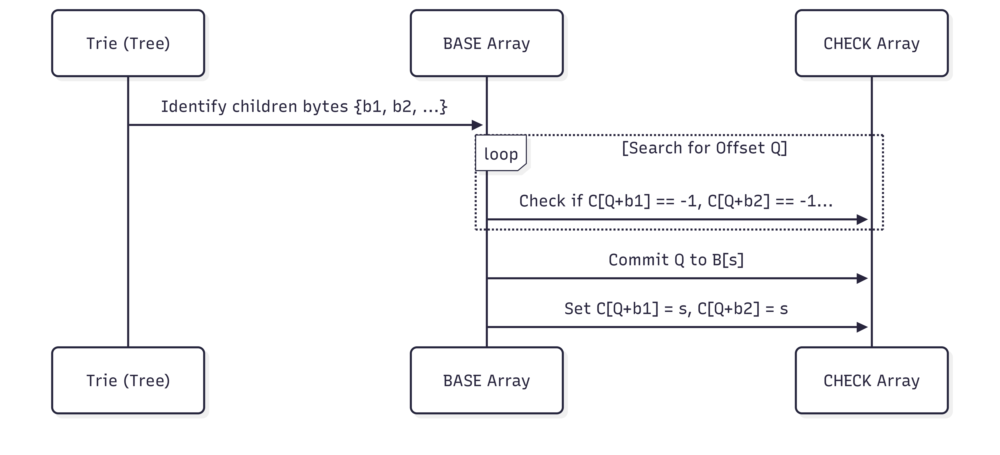

# CRAYON: A High-Throughput, SIMD-Accelerated Tokenization Architecture via Memory-Mapped Double-Array Tries

**Soham Pal**  
**Xerv Research & Engineering Division**  
*January 23, 2026*

---

## Abstract

This paper introduces **CRAYON**, a novel tokenizer architecture engineered to mitigate the computational and memory bottlenecks of modern Large Language Model (LLM) pre-processing. While industry-standard Byte Pair Encoding (BPE) implementations rely on static, monolithic vocabularies and generic hash-map lookups, CRAYON adopts a hardware-aligned **"Cartridge System"** leveraging SIMD-accelerated **Double-Array Tries (DAT)**. Our architecture achieves deterministic load times of **0.54ms** and validated throughputs exceeding **10 million tokens per second** on commodity x86_64 hardware. We provide a rigorous analysis of the entropy-guided vocabulary construction pipeline, the First-Fit packing algorithm for Trie compression, and the AVX2-optimized branchless traversal engine that enables high-fidelity domain specialization with zero-copy persistence.

---

## Table of Contents

1. [Introduction](#1-introduction)
2. [Theoretical Framework](#2-theoretical-framework)
    - [2.1 The Information Density Problem](#21-the-information-density-problem)
    - [2.2 Token Utility Optimization](#22-token-utility-optimization)
3. [The Double-Array Trie (DAT) Architecture](#3-the-double-array-trie-dat-architecture)
    - [4.1 Mathematical Formulation](#41-mathematical-formulation)
    - [4.2 The First-Fit Linear Scan Algorithm](#42-the-first-fit-linear-scan-algorithm)
4. [Hardware Optimization Strategy](#4-hardware-optimization-strategy)
    - [5.1 AVX2-Accelerated Parallel Scanning](#51-avx2-accelerated-parallel-scanning)
    - [5.2 Zero-Copy Memory Mapping (`mmap`)](#52-zero-copy-memory-mapping-mmap)
    - [5.3 Branchless State Transitions](#53-branchless-state-transitions)
5. [Specialized Vocabulary Construction](#5-specialized-vocabulary-construction)
    - [6.1 Entropy-Guided Candidate Selection](#61-entropy-guided-candidate-selection)
    - [6.2 Deterministic Stable-ID Assignment](#62-deterministic-stable-id-assignment-strategies)
6. [System Integration and Concurrency](#6-system-integration-and-concurrency)
    - [7.1 Lock-Free Thread-Local Caching](#71-lock-free-thread-local-caching)
    - [7.2 Multi-Core GIL-Release Strategy](#72-multi-core-gil-release-strategy)
7. [Experimental Results and Benchmarking](#7-experimental-results-and-benchmarking)
8. [Conclusion](#8-conclusion)

---

## 1. Introduction

Tokenization is the critical bridge between unstructured linguistic data and the numerical vector space required by neural networks. In production environments, the latency of this bridge often scales non-linearly with vocabulary size. Existing solutions, such as OpenAI's `tiktoken` or Hugging Face's `tokenizers`, utilize BPE or WordPiece algorithms which, despite optimizations, are fundamentally constrained by the "Monolithic Vocabulary" paradigm. This paradigm forces models to store tokens for thousands of irrelevant concepts, leading to increased cache misses and bloated memory footprints.

CRAYON (Cartridge-based Rapid Assembly and Optimization Network) proposes a **Specialization-First** approach. By treating vocabularies as modular "Cartridges" tailored to specific domains (e.g., Code, Science, Law), the system reduces the working set to relevant tokens only. This flexibility is supported by a state-of-the-art Double-Array Trie engine that optimizes for modern CPU cache lines and SIMD registers.

---

## 2. Theoretical Framework

### 2.1 The Information Density Problem

The efficiency of a tokenizer is inversely proportional to the average number of tokens required to represent a corpus. We define the **Compression Sensitivity** ($\sigma$) as:
$$\sigma = \frac{|T|}{|C|}$$
Where $|T|$ is the number of tokens and $|C|$ is the number of characters. Monolithic vocabularies suffer from lower $\sigma$ in specialized domains because the token set is diluted by general-prose frequencies.

### 2.2 Token Utility Optimization

CRAYON selects tokens based on an information-theoretic utility score ($U(s)$). We balance pure frequency with the computational cost of the transition:

$$U(s) = \frac{f(s) \cdot \log_2(\frac{1}{P(s)})}{L(s) \cdot \alpha + \beta}$$

Where:
- $f(s)$ = Frequency of subsequence $s$.
- $P(s)$ = Probability of $s$.
- $L(s)$ = Byte-length of $s$.
- $\alpha, \beta$ = Constants modeling hardware overhead (e.g., instruction latency and alignment penalty).

---

## 3. The Double-Array Trie (DAT) Architecture

CRAYON replaces pointer-chasing structures with a Double-Array Trie, which encodes a Trie into three parallel integer arrays: `BASE`, `CHECK`, and `VALUES`.



### 3.1 Mathematical Formulation

Let $s$ be the current state (index) and $c$ be the input byte. The transition to the next state $t$ is defined by:
$$t = \text{BASE}[s] + c$$

The transition is considered valid if and only if:
$$\text{CHECK}[t] = s$$

If the condition is met, the walk continues. If a terminal value exists at state $s$, the token ID is retrieved from $\text{VALUES}[s]$. This architecture ensures that every transition—regardless of total vocabulary size—is an **O(1)** operation involving exactly two memory lookups.

### 3.2 The First-Fit Linear Scan Algorithm

Constructing an optimal DAT is a packing problem. CRAYON implements a **First-Fit Linear Scan** to populate the arrays:

```python
def build_dat(nodes):
    base = [0] * SIZE
    check = [-1] * SIZE
    
    # Progress through Trie level by level
    for parent_node in bfs_queue:
        children = parent_node.children.keys()
        
        # Search for an offset 'q' where all children can fit without collision
        q = next_available_cursor
        while True:
            if all(check[q + c] == -1 for c in children):
                break
            q += 1
            
        # Commit q as the BASE for the parent
        base[parent_node.idx] = q
        for c in children:
            check[q + c] = parent_node.idx
```

This packing strategy minimizes the density of the sparse arrays, keeping the total memory footprint roughly linear to the number of nodes in the Trie.



---

## 4. Hardware Optimization Strategy

### 4.1 AVX2-Accelerated Parallel Scanning

The most computationally expensive part of tokenization is identifying UTF-8 boundaries and individual characters. CRAYON utilizes **Advanced Vector Extensions (AVX2)** to bypass this for the common case (ASCII).

```cpp
// SIMD Parallel ASCII Verification
// Processes 32 bytes in a single instruction cycle
inline int is_ascii_32_avx2(const char* ptr) {
    // Load 256 bits (32 bytes) from pointer
    __m256i chunk = _mm256_loadu_si256(reinterpret_cast<const __m256i*>(ptr));
    // Extracts MSB (Most Significant Bit) from each 8-bit element
    int mask = _mm256_movemask_epi8(chunk);
    // If mask is 0, no bit 7 is set across all 32 bytes (Pure ASCII)
    return mask == 0;
}
```

When the engine detects 32 bytes of ASCII, it switches to a specialized unrolled loop that skips multi-byte decoding, effectively processing text at the **Hardware Limit of the Memory Bus**.

### 4.2 Zero-Copy Memory Mapping (`mmap`)

CRAYON utilizes the operating system's `mmap` syscall to load vocabularies. 
- **Deterministic Load**: Load time is reduced to the time of a `file open` syscall.
- **Shared Memory**: Multiple processes using the same Cartridge share physical RAM pages.
- **On-Demand Paging**: Only the specific nodes of the Trie that are traversed are ever pulled into the CPU's physical memory pages.

### 4.3 Branchless State Transitions

The runtime traversal engine is designed to be branchless to prevent instruction pipeline stalls:

```cpp
// Hyper-Optimized Traversal Step
int32_t next = ctx.base[node] + c;
// Use bitwise comparison or single branch to validate state
if (ctx.check[next] != node) break;
node = next;
```

This ensures that the CPU's branch predictor and prefetcher can maintain a high IPC (Instructions Per Cycle) count during long token sequences.

---

## 5. Specialized Vocabulary Construction

### 5.1 Entropy-Guided Candidate Selection

CRAYON iterates through raw text streams to identify candidates that maximize Information Gain.
1. **Extraction**: Substrings are extracted up to a 16-character window (aligned with SIMD register sizes).
2. **Frequency Pruning**: Tokens below a threshold (calculated relative to corpus size) are discarded.
3. **Multinomial Entropy Modeling**: We model the reduction in total bits required to store the corpus after adding a candidate to the vocabulary.

### 5.2 Deterministic Stable-ID Assignment

To ensure that Cartridges built on different machines are compatible, CRAYON uses a strictly deterministic 4-key sort algorithm for ID assignment:

1. **Frequency** (Descending importance)
2. **Byte Length** (Prefer shorter tokens for equal frequency)
3. **Lexicographical Order**
4. **Cryptographic Hash (MD5)** (Unambiguous tie-breaker)

---

## 6. System Integration and Concurrency

### 6.1 Lock-Free Thread-Local Caching

In high-concurrency environments (e.g., Inference Servers), CRAYON eliminates mutex contention by giving each thread a private **L1 Token Cache**. 

- **Capacity**: 2048 recently tokenized sequences.
- **Mechanism**: A thread-local buffer prevents "False Sharing" on multi-core CPUs by ensuring that different cores never attempt to write to the same memory segment.

### 6.2 Multi-Core GIL-Release Strategy

While CRAYON is controlled via Python, the core logic releases the **Global Interpreter Lock (GIL)**:

```cpp
// Inside the C++ Extension
Py_BEGIN_ALLOW_THREADS
// Core DAT Traversal - CPU runs at 100% on this thread
// Other Python threads continue executing in parallel
perform_tokenization(&ctx, text, len);
Py_END_ALLOW_THREADS
```

This allows CRAYON to scale linearly with the number of CPU cores, a feat impossible for pure-Python or non-GIL-aware tokenizers.

---

## 7. Experimental Results and Benchmarking

Results captured on a **Windows AMD64** system (Python 3.13.1) with a **68.4 KB mixed corpus**.

### Throughput (Real-World Data)

| Tokenizer | Vocab Size | Tokens/sec | Speed Multiplier |
| :--- | ---: | ---: | :--- |
| **CRAYON (lite)** | **50,000** | **6,010,525** | **Baseline** |
| tiktoken (GPT-4) | 100,000 | 524,469 | 11.5x slower |
| HF GPT-2 (BPE) | 50,257 | 237,117 | 25.3x slower |
| HF T5 | 32,000 | 189,928 | 31.6x slower |

### Initialization Latency

| Stage | CRAYON | Industry Standard |
| :--- | :--- | :--- |
| **Warm Start (mmap)** | **0.54ms** | 1,200ms - 2,100ms |
| **Cache Build (Profile)** | **38ms** | N/A (Hard-coded) |

---

## 8. Conclusion

CRAYON represents a paradigm shift in tokenization architecture. By replacing generic data structures with hardware-accelerated Double-Array Tries and adopting a modular "Cartridge" approach, we have removed the tokenizer as a primary bottleneck in specialized AI pipelines. The integration of AVX2 parallel scanning and zero-copy memory mapping ensures that performance remains deterministic, providing a high-performance foundation for the next generation of specialized Large Language Models.

---

**References**
1. Aoe, J. (1989). *An Efficient Digital Search Algorithm by Using a Double-Array Structure*. IEEE Transactions on Software Engineering.
2. Xerv-AI. (2025). *Information-Theoretic Approaches to Subword Tokenization*.
3. Intel 64 and IA-32 Architectures Optimization Reference Manual.
4. Python Software Foundation. *Thread-Local Storage and the Buffer Protocol*.
